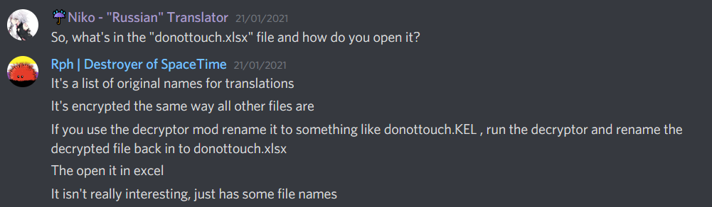

# Common File Types

Introduction

When modding OMORI, you'll encounter different file types. This page aims to explain the [decrypted](https://omori.wiki.mods.one/modding:getting_started#decrypting_the_game) files, and the file types you can use to modify the game, which are not the same.

## Common file types <a href="#common_file_types" id="common_file_types"></a>

These file types are commonly used by OMORI and you'll encounter these when [decrypting](https://omori.wiki.mods.one/modding:getting_started#decrypting_the_game) the game.

#### .js - JavaScript <a href="#js_-_javascript" id="js_-_javascript"></a>

_**Encrypted:** yes, as .OMORI files_\
&#xNAN;_**Patching:** not directly (read on)_

OMORI uses [JavaScript](https://developer.mozilla.org/en-US/docs/Learn/JavaScript/First_steps/What_is_JavaScript) [files for its game logic](#user-content-fn-1)[^1]

These files can't be [patched](https://omori.wiki.mods.one/modding:patching), but the functions they define can usually be just overwritten. This means that in mods you can, for the most part, just create the same file structure the game has and modify functions as you need. Just remember that your code doesn't _replace_ the original files, your function definitions will simply overwrite the previous ones, normally through object prototype manipulation, which is what the normal game files do as well:

```javascript
SomeObject.prototype.function = function() {...}
```

To summarize, mods may look like they are patching JavaScript files, because for the most part, you can overwrite the functions as if the files where able to be patched, but it's an important difference to the other files, where the mod's file will be loaded [_instead_ of the normal game file](#user-content-fn-2)[^2] and not _in addition to_, as is with JS files. [More Info on JS in OMORI](https://omori.wiki.mods.one/modding:file-types#javascript_addendum).

#### .json - JavaScript Object Notation <a href="#json_-_javascript_object_notation" id="json_-_javascript_object_notation"></a>

_**Encrypted:** yes, as .KEL_\
&#xNAN;_**Patching:** normal patching, and can also be_ [_delta-patched_](https://omori.wiki.mods.one/modding:file-types#jsond_-_json_patch_files)

[JSON](https://developer.mozilla.org/en-US/docs/Learn/JavaScript/Objects/JSON) files only hold data, no JavaScript logic. They are used by the game to store enemy descriptions, or events. They might contain data that gets interpreted by the game as if it was game logic. These files can be normally [patched](https://omori.wiki.mods.one/modding:patching), and [delta-patched](https://omori.wiki.mods.one/modding:delta-patching). JSON files are very easy to work with in JavaScript, because all data types supported by JSON can be mapped 1-to-1 into a JavaScript object or array. It's worth mentioning that JSON doesn't support all types that a JS object does, like functions.

#### .png - Transparent image files <a href="#png_-_transparent_image_files" id="png_-_transparent_image_files"></a>

_**Encrypted:** yes, as .rpgmvp_\
&#xNAN;_**Patching:** normal replacement or delta patching using_ [_image deltas_](https://omori.wiki.mods.one/modding:replacing_images#image_deltas)

PNG files are image files that support transparency. This is how the game stores all common images.

#### .yaml - YAML Ain't Markup Language <a href="#yaml_-_yaml_ain_t_markup_language" id="yaml_-_yaml_ain_t_markup_language"></a>

_**Encrypted:** yes, as .HERO_\
&#xNAN;_**Patching:** normal replacement or delta patching using_ [_.yamld_](https://omori.wiki.mods.one/modding:file-types#yamld_-_yaml_patch_files)

[YAML](https://www.tutorialspoint.com/yaml/yaml_introduction.htm) files are similar to _.json_ files, in that they hold the same data types, like strings, numbers, objects etc. The two big differences regarding OMORI is that YAML files have a different, more human-friendly syntax, and they support comments, which JSON files don't. YAML files are primarily used for dialogue files found in _\\/languages\\_/, and are therefore more comfortable to edit than JSON.

**.yml - The legacy file extension**

_.yml_ is a [legacy file extension](https://yaml.org/faq.html), which means it used to be used for YAML files, but the official file extension today is _.yaml_. Most programs will still recognise _.yml_ as a YAML file. **We recommend using only&#x20;**_**.yaml**_**&#x20;for constistency**. You'll encounter _.yml_ with projects that used files decrypted using the [decryptor mod for Gomori](https://github.com/toshirodesu/omori_decrypt), which outputs files with the _.yml_ extension. The built-in [decryptor](https://omori.wiki.mods.one/modding:getting_started#decrypting_the_game) of OneLoader will output the same files with a _.yaml_ extension.

#### .ogg - Vorbis audio <a href="#ogg_-_vorbis_audio" id="ogg_-_vorbis_audio"></a>

_**Encrypted:** yes, as .rpgmvo_\
&#xNAN;_**Patching:** normal replacement_

_.ogg_ files contain compressed audio using the [Vorbis](https://en.wikipedia.org/wiki/Vorbis) codec. They can be [patched](https://omori.wiki.mods.one/modding:patching) normally.

### Delta files <a href="#delta_files" id="delta_files"></a>

Deltas are explained [here](https://omori.wiki.mods.one/modding:delta-patching). They are special file types to modify a game file. They are not used by the base game, only by OMORI mods through the help of OneLoader. The file types that can be used for delta patching are:

#### .jsond - JSON patch files <a href="#jsond_-_json_patch_files" id="jsond_-_json_patch_files"></a>

Patch only parts of the object contained within a game's JSON file by loading a \`.jsond\` file. The syntax to modify JSON objects can be found [here](https://jsonpatch.com/). Here's a [JSON patch generator](https://extendsclass.com/json-patch.html) which you can use to generate patches by supplying the original file, and the state after your modifications. We recommend this, because manually writing JSON patches is hard.

#### .yamld - YAML patch files <a href="#yamld_-_yaml_patch_files" id="yamld_-_yaml_patch_files"></a>

You can use _.yamld_ files to patch YAML files similar to _.jsond_. You might think that the content needs to be the json-patch format, but instead with YAML syntax, but this is not the case. Unlike YAML files, which naturally contain YAML syntax, _.yamld_ files **must contain JSON** syntax that matches the json-patch schema, just like \`.jsond\` files. _(Todo: add example to illustrate)_

#### .olid - OneLoaderImageDelta <a href="#olid_-_oneloaderimagedelta" id="olid_-_oneloaderimagedelta"></a>

OneLoaderImageDelta files contain patching instructions for PNG files. You can find out more on the wiki page about [replacing images](https://omori.wiki.mods.one/modding:replacing_images#image_deltas).

### Less common file types <a href="#less_common_file_types" id="less_common_file_types"></a>

#### .webm - Video files <a href="#webm_-_video_files" id="webm_-_video_files"></a>

_**Encrypted:** no_\
&#xNAN;_**Patching:** normal replacement_

[WebM](https://en.wikipedia.org/wiki/WebM) files are lossy video files encoded using [VP9](https://en.wikipedia.org/wiki/VP9).

#### .ttf - Font files <a href="#ttf_-_font_files" id="ttf_-_font_files"></a>

_**Encrypted:** no_\
&#xNAN;_**Patching:** normal replacement_

_TBA_

#### donottouch.xlxs - language file index table <a href="#donottouchxlxs_-_language_file_index_table" id="donottouchxlxs_-_language_file_index_table"></a>

_**Encrypted:** yes, same encryption as .KEL, but encrypted file also has .xlxs extension._\
&#xNAN;_**Patching:**_ [_don't_](#user-content-fn-3)[^3]

<div align="left"><figure><figcaption><p>Explanation of donottouch.xlxs</p></figcaption></figure></div>

### Other known file types <a href="#other_known_file_types" id="other_known_file_types"></a>

_.so, .lib, .dll_

**JavaScript Addendum**

You should know that you don't have to keep the same file structure, or names, or even contents. You can name your files whatever you want, as long as you load them properly through the [mod.json](https://omori.wiki.mods.one/modding:mod.json) file. You can also have all functions in a single or just a few files, if you want.

[^1]: The game runs in an environment that combines a conventional browser with a [Node.js](https://www.educative.io/blog/what-is-nodejs) instance. Because OMORI uses [RPG Maker MV](https://en.wikipedia.org/wiki/RPG_Maker#RPG_Maker_MV), which in turn uses [PIXI.js](https://pixijs.com/), you mostly don't need any HTML or CSS knowledge. We might go into the details of PIXI.js in relation OMORI in a different wiki entry.

[^2]: Excluding delta files

[^3]: As far as we can tell, there's no need to modify this file, and it might actually just mess up stuff. \[Sources required lol]
