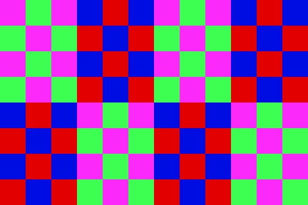
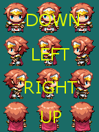
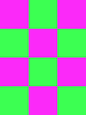

# RPG Maker Sprite Sheet Formats

_RPG Maker MV uses sprite sheets to display characters and events. The files containing these sheets are found in img/pictures in OMORI._&#x20;

## Normal Sprite Sheets

A normal sprite sheet with no additional naming and edits will contain 4 columns and 2 rows of character sheets, which are each further broken down into 3 columns and 4 rows of sprites, 1 row and 3 frames for each direction. Here is an image below Showing what a sprite sheet will look like:

<figure><figcaption>
Normal RPG Maker MV sprite sheet
</figcaption></figure>

The sizing of the tiles do not matter (though every tile must be equal in size), the sprite sheet will always be cut in this way. It should be noted, though, that most of Omori's sprite sheets have a single tile width of 32 x 32 pixels, and the same applies to this specific sheet.&#x20;

The directions for the sprites are shown below:

<figure><figcaption></figcaption></figure>

This applies to every single character sheet and cannot be changed.

## Single Character Sheets

If you only want to have a single character sheet in the image, much like what is shown in the image above, then you must add a prefix to your sprite's file name. The prefix to make a sprite sheet singular is `$`, for example `$DW_Aubrey.png`. This will cause RPG Maker MV to only cut the image into 4 rows and 3 columns, much like a single section of the normal sheet. Here is an image below showing the new sheet format with the `$` prefix:

<figure><figcaption>
Single Character Sheet
</figcaption></figure>

Continue to note that the size of the tiles does not matter as long as they are equal. For example, a tile can be 30 x 48 px as long as that applies to every single tile in the sheet.

## Offset Sprite Sheets

RPG Maker Mv sprite sheets are automatically offset by 6 pixels to make NPCs and characters look more natural when put next to other objects and buildings. However, if you want to remove this offset, for example if you wanted to add a door object, then you can add a `!` prefix to your sprite sheet (for example, `!door.png`).

## More Filename Prefixes and Suffixes


[sprite-sheet-filenames.md](sprite-sheet-filenames.md)


