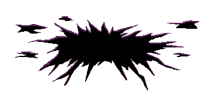
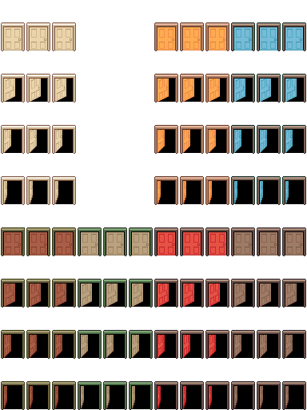
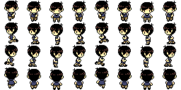

# Sprite Sheet Filenames

Sometimes some sprite sheet have special character associated in the file name, which changes it's function.

Sprites are set by the **top-left corner** of the sprite. Meaning larger sprites will overlap to the bottom-right tiles.

## Table Summary

<table><thead><tr><th width="96">Char</th><th width="162">Example</th><th width="339">Description</th><th>Omori Use Case</th></tr></thead><tbody><tr><td></td><td>name.png</td><td>
Standard regular sprite sheet. Having 8 character in total in sets of 3x4 tiles, totals to 12x8 tiles. In OMORI case the cells are usually in 32x32 pixel. 

<strong>It is possible to have larger sprite, the engine simply divide by 12x8.</strong>
</td><td>Default</td></tr><tr><td><code>$</code></td><td>$name.png</td><td>
Turns the sprite so it's only single character.

<strong>It is possible to have larger sprite, the engine simply divide by 3x4.</strong>
</td><td>Large unique enemies, Animated decorations</td></tr><tr><td><code>!</code></td><td>!name.png</td><td>In RPGMV characters will be shown <strong>6 pixels above tile</strong> by default. This <strong>removes that offset</strong>.</td><td>Doors, Decorations</td></tr><tr><td><code>[SF]</code></td><td>[SF]name.png</td><td>This makes it singular sprite. This may appear in preview incorrectly as divided, but will display in-game as singular image.</td><td>Large Decorations:  Chandeliers, Holes, Curtains</td></tr><tr><td><code>%(x)</code></td><td>name%(5).png</td><td><strong>This is a suffix, put at the end</strong>. This specifies specific amount of frames in horizontal direction, with <code>x</code> being the number.</td><td>Running Sprites, Fear Enemies</td></tr></tbody></table>


Prefixes also can be combined


## Examples

Here's some example sprite used in actual game, with context.

<figure><figcaption>
[SF]SW_Hole.png This hole is a single large sprite Appears in Sweetheart Castle.
</figcaption></figure> <figure><figcaption>
!objects_fa_doors.png ! removes the offset, good for doors. Note that the doors are 2 tiles tall as well, as it is slightly taller than 1 tile.
</figcaption></figure> <figure><figcaption>
$FA_OMORI_RUN%(8).png This is a running sprite, $ sign tells it's single character, %(8) tells there are 8 frame horizontal.
</figcaption></figure>


In some sprite you might notice some have a combination of multiple things in the same area. This is likely that the frames are still or hard set to specific frames, being set in RPGMV. By default RPGMV will go by 3x4 set treating like characters.


## Extra Resources


RPG Maker Forums on Sprite Sheet Formats

