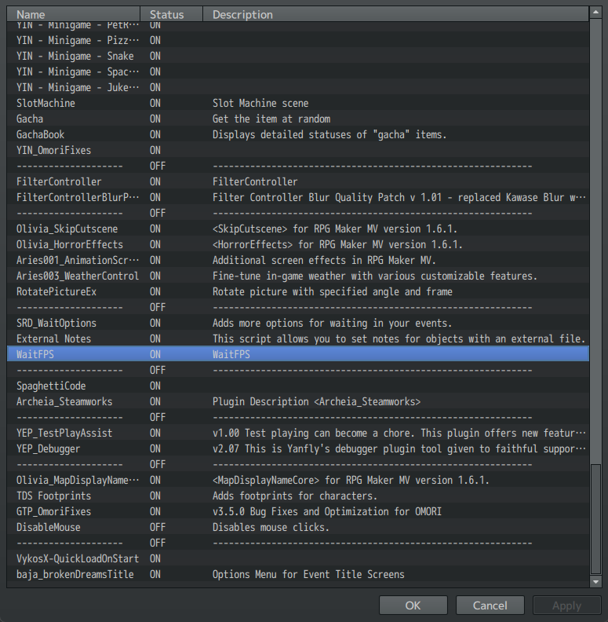
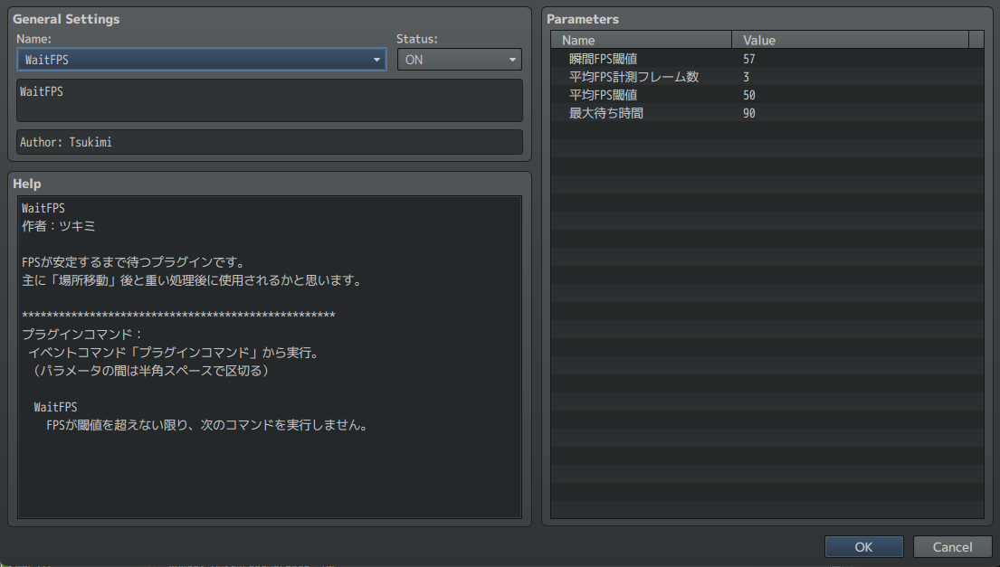
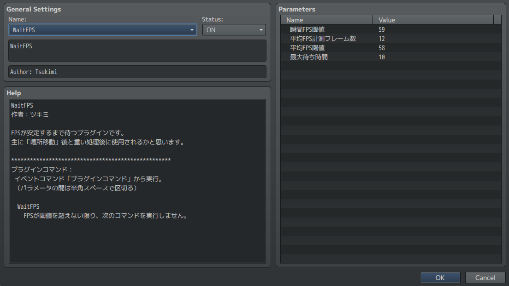

# FPS Wait Optimization

**NOTE: This is not a speedup or an FPS boost.**

OMORI utilizes a plugin that will make the game "pause" to give time for engine to catch up when doing heavy loading. This makes the game run smoother overall, but the current parameters for the plugin are excessive and can be tweaked to remove artificial loading times.

First, go to the Plugin Manager in RPG Maker MV (the "puzzle" icon on the top bar), then scroll down until you get to the WaitFPS plugin.

<figure><figcaption></figcaption></figure>

Click on it to bring up its settings.

<figure><figcaption></figcaption></figure>

You will want to change the numbers on the right until they match the below screenshot.

<figure><figcaption></figcaption></figure>

From there, click "OK" -> "Apply". There should be a decrease in loading time during room transitions and when loading many objects at once.
