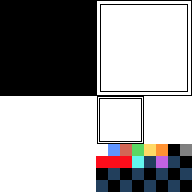

# Omori Text Color Convention

Omori tends to have a color for specific type of items, which are labelled to give emphasis. This is done with the color code command of /c\[n] as mentioned in Text Codes section of this wiki.&#x20;

## Color Source

The color picked are from Windows.png file, which is found in img/system/Windows.png

<figure><figcaption>
Windows.png file, which is found in img/system/Windows.png
</figcaption></figure>

In the Windows.png file, there is group of color pallette on the bottom right corner. The color picked are referenced from the color in the square. Starting from first square being number 0.


Note that Omori changes the Windows.png color palette from the usual standard default


## Color Convention

Omori uses Color for specific type of items, being the following:

<table><thead><tr><th width="70.33333333333331">ID</th><th width="90">Color</th><th>Type</th></tr></thead><tbody><tr><td>0</td><td>White</td><td>Default</td></tr><tr><td>1</td><td><mark style="color:blue;">Blue</mark></td><td>Skills</td></tr><tr><td>3</td><td><mark style="color:green;">Green</mark></td><td>Food</td></tr><tr><td>4</td><td><mark style="color:yellow;">Yellow</mark></td><td>Important Items</td></tr><tr><td>5</td><td><mark style="color:orange;">Orange</mark></td><td>Toys</td></tr><tr><td>11</td><td><mark style="color:blue;">Light Blue</mark></td><td>Locations</td></tr><tr><td>13</td><td><mark style="color:purple;">Purple</mark></td><td>Equipment and Character Names (excluding casual referrals, which remains white)</td></tr></tbody></table>
